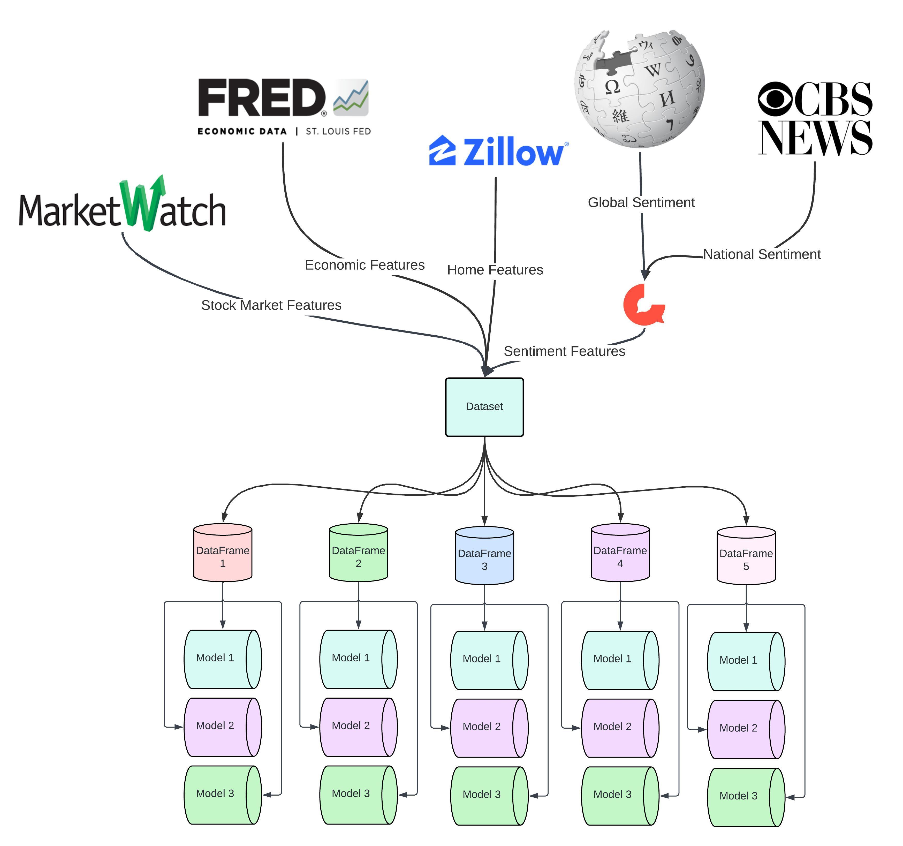
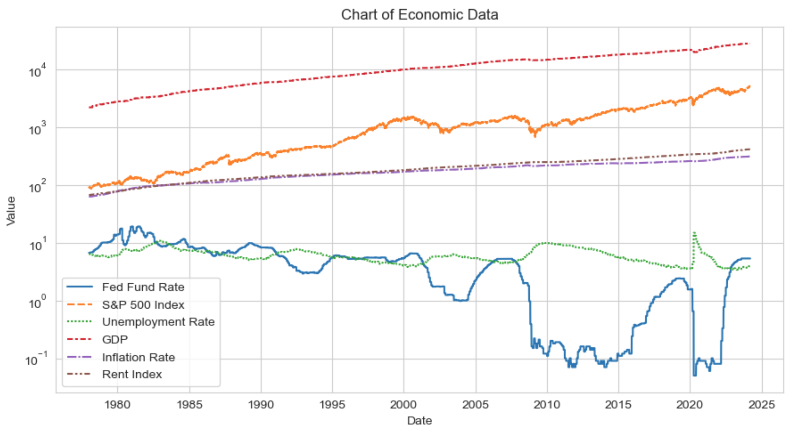
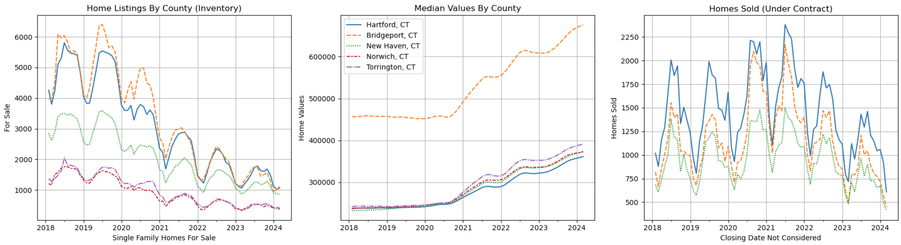
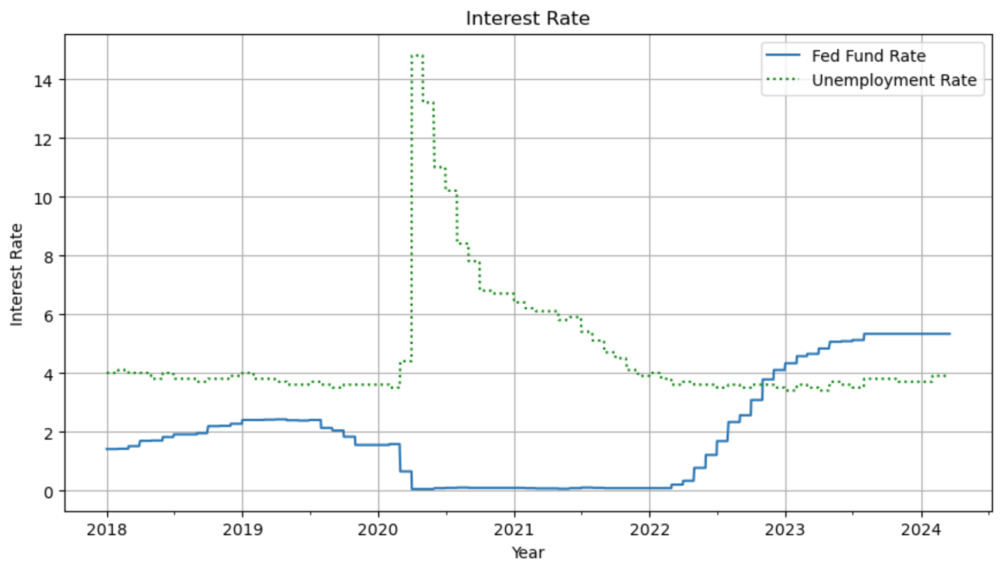
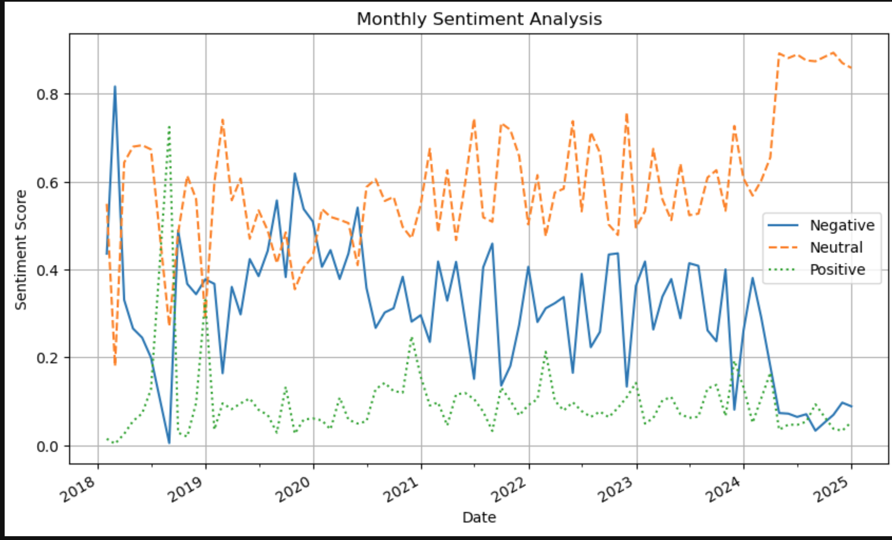

# New Haven County Real Estate Market
## Business Understanding
Real estate represents a significant investment for many individuals, often requiring financial support through loans. While it is widely regarded as an opportunity for investment, its pricing is influenced by a complex array of factors. Therefore, a thorough understanding of market trends is essential for making informed financial decisions.

The primary business objective is to determine the best time to buy a single-family home in [Connecticut](https://en.wikipedia.org/wiki/Connecticut). Numerous features influence the price of real estate, and the goal is to identify which features are most impactful in making a decision to invest in a home. Based on the insights gained, recommendations will be provided.

## Dataset Information
The dataset is a comprehensive aggregation from multiple sources, featuring a variety of start dates and reporting frequencies, including weekly and monthly intervals. A crucial component for analysis, the amount of homes listed, presents accessibility challenges. Specifically, Zillow provided listings data for only the past six years.

  

 

**Real Estate Data**: Sourced from [Zillow](https://www.zillow.com/research/data), this portion of the dataset includes monthly metrics such as home values, prices sold, number of homes listed, median sale price, and price paid above listing. The data is organized into two main categories:
* A single dataframe aggregating all mentioned features, segmented by county.
* Separate dataframes for each county, detailing the specific features relevant to that county.

**Economic Features**: These were derived from two distinct sources. The Federal Reserve Economic Data ([FRED](https://fred.stlouisfed.org/docs/api/fred/)) API provided data spanning the last decade. Conversely, the [MarketWatch](https://www.marketwatch.com/investing/index/spx/download-data) dataset furnished historical data dating back to 1978, albeit in one-year increments.

  

 

**Sentiment Features**: Extracted from [CBS News](https://www.cbsnews.com/news/year-in-review-top-news-stories-of-2018-month-by-month) and [Wikipedia](https://en.wikipedia.org/wiki/2018), these features encompass headlines and global events. The collected data was processed through a pre-trained language model named [TweetEval](https://github.com/cardiffnlp/tweeteval), designed to assess sentiment.

## Dataset Description

| Version | Decription                          | Notes                                                |
|---------| ------------------------------------| -----------------------------------------------------|
|1        | Initial dataset                     | Limited features from 2008 to 2022, baseline model.  |
|2        | County-specific real estate metrics | Monthly data from 2018 to present. The only dataset that includes supply and demand features. |
|3        | Home values across all counties     | Compares home values with macro events from 2000 to present. |
|4        | New Haven County features           | A revised version of 2, providing more data with weekly units for a more balanced class test. |
|5        | Features from 1978                  | Extracts the most features from the datasets, used to fine-tune the best models. Includes all features starting from 1978. |

## Notebook Description
1. **Baseline Model Notebook**: Establishes the initial model against which future models are compared. It serves as the foundational analysis for the project.
2. **Economic Features Aggregate Notebook**: Compiles economic indicators from MarketWatch and FRED. Note that accessing certain data sources requires an API key. Instructions for obtaining one can be found [here](https://fred.stlouisfed.org/docs/api/api_key.html).
3. **Zillow Real Estate Metrics Notebook**: Focuses on real estate data from Zillow. The housing data is adaptable and can be modified to suit analysis for any city or state.
4. **News Headlines Sentiment Analysis Notebook**: Analyzes news headlines from 2000 to 2016 using the pre-trained [TweetEval](https://github.com/cardiffnlp/tweeteval) model to assess sentiment. This notebook explores the impact of media sentiment on real estate trends.
5. **Wikipedia Global Events Data Scraping Notebook**: Scrapes Wikipedia to compile a comprehensive list of global events for specified years, providing context for the sentiment analysis.
6. **Global Sentiment Indicator Notebook**: Processes the scraped Wikipedia events through the [TweetEval](https://github.com/cardiffnlp/tweeteval) model to evaluate global sentiment. This analysis aims to understand the broader sentiment trends that may impact the real estate market.
7. **Model Testing Notebook**: Tests various models with different dataframes to identify the most effective approach for predicting real estate trends based on the identified features and sentiments.

## Findings
After organizing and examining the data, it became evident when the best times to buy a house are. The real estate market moves in predictable cycles with clear trends. Essentially, the number of homes listed for sale and the number sold each year follow a regular pattern: activity picks up at the beginning of the year, reaches its highest point around the middle of the year, and then slows down as the year ends. If you're looking to have a lot of options to choose from, the middle of the year is when the market is most active. However, if you're trying to get a good deal before prices go up, the start of the year is the optimal time to buy, especially in markets where prices are generally on the rise. Although we only had home listing data for the last six years, we noticed that as the number of homes sold decreased, so did the prices.

  

 

The economic indicators for 2018 were a bit unusual due to the Federal Reserve keeping interest rates exceptionally low for about eight years. Just as they began to raise rates, the COVID-19 pandemic occurred, distorting the data even further. The unemployment rate soared to its highest in 40 years, topping 14%.

  

 

Regarding market sentiment — the overall feel of the market based on news headlines and global events — it didn't significantly aid the analysis. The data we used in the TweetEval model showed that most news coverage focused on negative or neutral stories, with a significant emphasis on conflicts and wars. For sentiment analysis to provide meaningful insights, a more balanced mix of positive news is needed. However, this poses a challenge, as positive news and events are reported less frequently.

  

 

## Next Steps and Recommendation
Enhancing the depth and usefulness of the real estate data could be achieved by expanding the inventory of homes listed from the years 2000 to 2018. More detailed data would enable a more thorough analysis by providing additional observations. Additionally, the improvement of the economic sentiment indicator would significantly bolster the analysis, offering clearer insights into market trends.

Regarding the primary business question of identifying the optimal time to purchase a home, it appears that a complex machine learning model or neural network is not necessary to predict price movements. The dynamics of the real estate market, governed by supply and demand, clearly illustrate that as the housing supply dwindles, home prices tend to rise. For value-conscious buyers, the beginning of the year is identified as the ideal time to make a purchase, capitalizing on potentially lower prices. Conversely, buyers seeking a wider selection of homes might find it advantageous to wait until mid-year, as the market typically offers more choices at that time.

## Link to Notebook
- [New Haven Real Estate Models](https://github.com/teemak/capstone/blob/main/7_find_best_model.ipynb)
